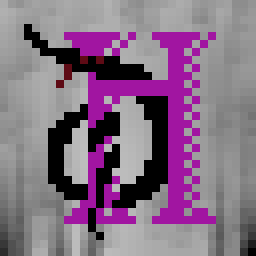
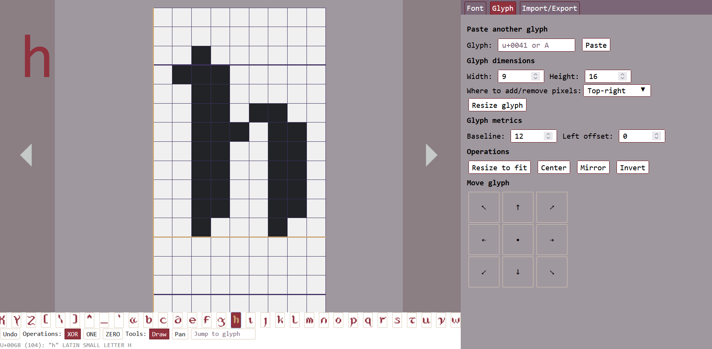

# Dothand — pixel font editor

Online tool for creation and TrueType export of pixel fonts.
[You can check it out here!](https://pages.0xa115a1.com/dothand)

## Inspiration!
This is a maintained fork of [Shad Amethyst's](https://github.com/adri326) [Online Pixel Font Creator](https://adri326.github.io/online-pixel-font-creator/index.html), which still stays one of the best tools for the use-case, and as far as I know, the only one with both TrueType font export and web-interface. 
While I quite enjoy working in it, I find it lacking some functionality. And, more importantly, though it's still online, lately it's having problems with font exports due to tome.
Therefore to fix a great tool, and maybe make it a bit better, I'm doing this.

## Progress?
As a base for development I used the author's unfinished SolidJs rewrite of the tool. And while it saved me from rewriting raw js into some framework, it still needed some work to get to a state, comparable to the old version.
Currently I consider this rework to be generally on par with the original, of course somewhere lacking old features, but providing new.
Notable additions include:
- Working font export
- Reworked calculations of TrueType dimensions metadata to better reflect the standards, as previous approach sometimes lead to rendering issues and broken exports, and notably lead to most extremely wide fonts be considered incorrect.
- A set of glyph-wise operations for centering, mirroring, and bit-invert. (And font-wize centering for monospace font making)
- Glyph move tool (which sadly for now doubles as a replacement for select tool)
- Support of several named saves in browser's localStorage.
- And well, a bunch of refactoring and UI fixes, but that's not a feature.

## TODO
### Old-features revival:
- [ ] Selection 
- [ ] Text preview
- [ ] Edit history
- [ ] More dimensional helpers
### Planned new features:
- [ ] Add TTF and WOFF export 
- [ ] More tools: brushes / rectangles for drawing / selection.
- [ ] Add more inputs for the rest of font metadata. 
- [ ] Better glyph navigation, e.g. by Unicode block.
- [ ] Autosave
- [x] More hotkeys, 
- [ ] Common hot-key schemes support.
- [ ] Prettifying the UI generally,
    - [ ] Tooltips
    - [ ] Custom layouts
    - [ ] Color themes
    - [ ] Icons
### Refactor:
- [ ] Centralize data/types
- [ ] Cut up listeners, when it's will make sense to
- [ ] Rewrite/Wrap Glyph à la Font Controller, it's a bit annoying to replace the glyph with a mutated one using a setter. Perhaps as a wrapper over a signal or in FontController itself (not a good style). There is surely a reason it's treated as immutable, so rewriting it's class to convenient mutability is probably not the brightest idea.
- [ ] Rewrite some of the data-structures. Freezed objects and indexed enums to Maps/named types for convenience. And tuple/arrays to objects where it's necessary (e.g. Corner tuple in truetype conversion)